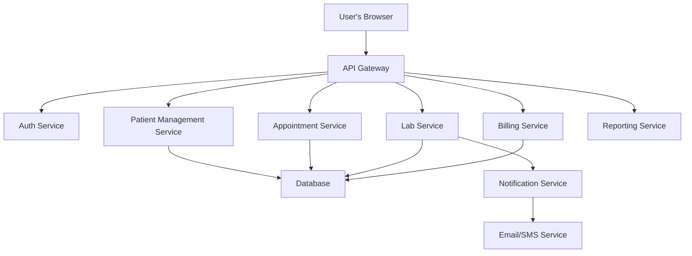

# High-Level Software Architecture for IVF Clinic Web Application

## Executive Summary & Architectural Vision

The proposed architecture for the IVF Clinic Web Application focuses on creating a robust, scalable, and secure platform that facilitates patient management, clinical workflows, laboratory processes, and administrative tasks. The architecture will leverage microservices to ensure each component is independently deployable, scalable, and maintainable, thereby enhancing overall system resilience and performance. 

### Key Design Decisions:
- **Microservices Architecture:** Each functional area, such as patient management, scheduling, lab results, and billing, will be developed as independent microservices.
- **Cloud-Native Design:** The application will be deployed in a cloud environment to take advantage of scalability and reliability.
- **Interoperability:** The application will adhere to HL7 FHIR standards for data exchange with external systems.
- **Security:** Ensuring data privacy and compliance with regulations such as HIPAA and GDPR will be a primary concern, with robust authentication and authorization mechanisms.

## Architectural Diagram (Component View)

## Microservice Design & Responsibilities

### 1. Patient Management Service
- **Core Responsibility:** Manage patient records, demographics, and consent forms.
- **API Endpoints:**
  - `GET /patients`
  - `POST /patients`
  - `PUT /patients/{id}`
- **Data Model:** Patient ID, Name, DOB, Contact Info, Medical History.

### 2. Appointment Service
- **Core Responsibility:** Handle scheduling and management of patient appointments.
- **API Endpoints:**
  - `GET /appointments`
  - `POST /appointments`
  - `DELETE /appointments/{id}`
- **Data Model:** Appointment ID, Patient ID, Doctor ID, Date, Time.

### 3. Lab Service
- **Core Responsibility:** Manage lab test orders and results.
- **API Endpoints:**
  - `GET /lab-results`
  - `POST /lab-requests`
- **Data Model:** Lab ID, Test Type, Results, Patient ID.

### 4. Billing Service
- **Core Responsibility:** Manage billing and payment transactions.
- **API Endpoints:**
  - `GET /billing`
  - `POST /billing`
- **Data Model:** Invoice ID, Patient ID, Amount, Status.

## Data Management Strategy

### Database Technology
- **Patient Management:** PostgreSQL for structured patient data with ACID compliance.
- **Appointment Management:** MongoDB for flexible scheduling data that may change frequently.
- **Lab Management:** DynamoDB for fast retrieval of lab results and scalability.
- **Billing Management:** MySQL for transaction processing and relationships.

## Integration & Communication Patterns

### Synchronous Calls
- API Gateway will handle synchronous calls for real-time data retrieval (e.g., retrieving patient records).

### Asynchronous Events
- Use of message queues (e.g., RabbitMQ, Kafka) for events such as:
  - Lab Result Received
  - Appointment Reminders

## Security & Compliance Architecture

### Authentication & Authorization
- **OAuth 2.0** and **OpenID Connect** for user authentication.
- Role-Based Access Control (RBAC) for service authorization.

### Data Protection
- Data encryption at rest and in transit using AES-256 and TLS.

### Audit Trail
- Comprehensive logging of data access and modifications for compliance.

## Non-Functional Requirements (NFRs) & Trade-offs

### Scalability
- The architecture will support horizontal scaling of microservices to handle varying loads.

### Performance
- Expected latency for API requests should not exceed 200ms.

### Reliability
- Implement health checks and circuit breakers to ensure service reliability.

### Architectural Trade-offs
- Choosing eventual consistency for lab results to enhance performance and responsiveness.
- Prioritizing security measures which may impact raw performance in certain workflows.

---

This architectural document provides a foundation for developing a robust IVF clinic application that meets the needs of healthcare providers and patients while ensuring security and compliance in handling sensitive medical data.